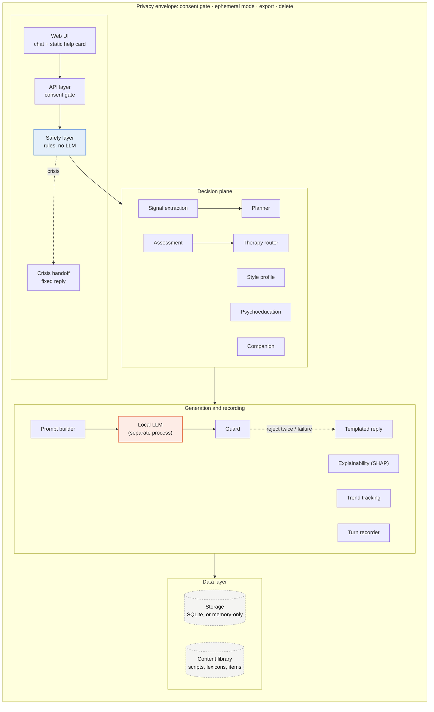
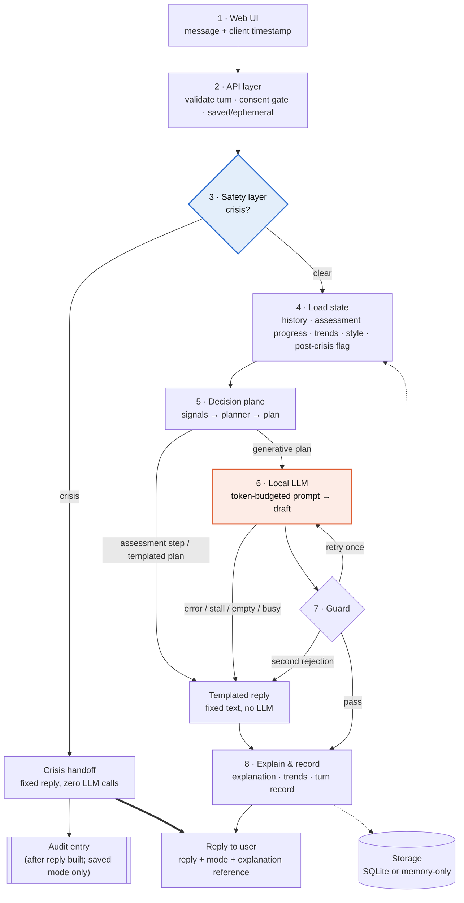
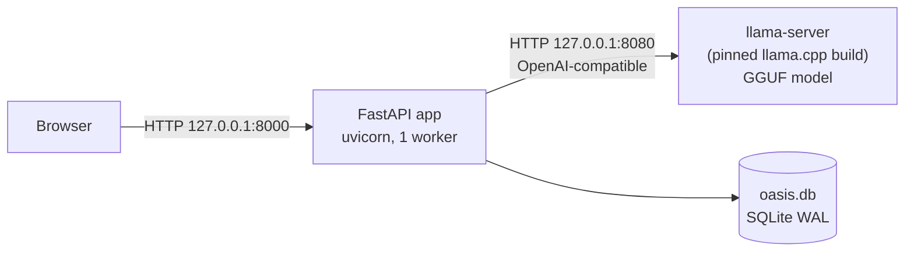

# OASIS — Architecture (v2, approved)

| Field | Value |
|---|---|
| Status | Approved design, documented in Step A |
| Last updated | 2026-10-07 |
| Source diagrams | [images/architecture_v2.png](images/architecture_v2.png), [images/data_flow.png](images/data_flow.png) |

**Principle:** *a rule-based decision plane plans each reply; the LLM only phrases it.* Safety decides before the LLM ever runs; any failure falls back to a templated reply.

> **Change from the original data-flow PNG.** The PNG shows the API layer reading storage before the safety check. The adopted decision is **safety before any storage access**, so a broken database can never block the crisis handoff. The Mermaid diagram in §3 is authoritative; the PNG is kept for history.

---

## 1. Layered architecture



Legend: blue = safety gate (runs first, no LLM); orange = local LLM (separate process); dashed = stored data; dotted arrows = shortcut paths.

Bias evaluation is an **offline test harness** (`scripts/bias_eval.py` + `tests/bias/`), not a runtime component, so it does not appear above.

---

## 2. Components

Each component lists **responsibility**, **inputs → outputs**, **dependencies** (allowed imports), and **failure behaviour**. Package names refer to `src/oasis/`.

### 2.1 Web UI — `web/`
- **Responsibility:** calm, text-only chat page; onboarding/disclosure; assessment card with 0–3 buttons; "why this reply" panel; mood-trend view; settings (style, ephemeral, export, delete); debug page; static "Need help now?" card.
- **In → out:** user keystrokes → `POST /chat` with message + client timestamp; renders reply, mode, explanation link.
- **Dependencies:** none at runtime beyond the backend's own origin. No CDN, font or analytics requests.
- **Failure:** network error or timeout shows a fixed offline message *and* keeps the help card available — the help card's content is inlined in the HTML, so it works with the backend down.

### 2.2 API layer — `api/`
- **Responsibility:** FastAPI routes, Pydantic v2 schemas, middleware (security headers, `Cache-Control: no-store`, request size limit, request-ID, log scrubbing), session resolution from the `X-OASIS-Session` header, consent gate, saved/ephemeral selection, hard request timeout.
- **In → out:** HTTP request → validated `TurnInput` → `ChatEngine.handle_turn()` → `ChatResponse`.
- **Dependencies:** `core`, `storage` (for repositories), `llm` (wiring only), settings.
- **Failure:** validation error → 422 with a typed error shape; unhandled exception → templated reply with HTTP 200 for `/chat` (the user is never shown a stack trace or a blank screen), logged without content.

### 2.3 Safety layer — `safety/`
- **Responsibility:** normalise text and match tiered crisis patterns (explicit intent, passive ideation, plan/method, burden); allow-list of unambiguous idioms; optional add-only classifier hook.
- **In → out:** raw message text → `SafetyVerdict { is_crisis, tiers_matched, pattern_ids, ruleset_version }`.
- **Dependencies:** **stdlib only** plus its own YAML pattern files (loaded once at startup and validated). Must not import `llm`, `storage`, `api`, `core`, any network or database module.
- **Failure:** fails **closed** — any exception yields `is_crisis=True` with `pattern_ids=["internal_error"]`. If pattern files fail to load at startup, the app refuses to start.

### 2.4 Crisis handoff — `safety/handoff.py`
- **Responsibility:** produce the fixed crisis reply (verified resources) and enter post-crisis state.
- **In → out:** `SafetyVerdict` (or PHQ-9 item-9 escalation) → fixed `ChatResponse(mode="crisis")`.
- **Dependencies:** content library (resource list) only. Zero LLM calls, no routing, companion or guard logic.
- **Failure:** the resource text is also compiled in as a constant, so a missing content file still produces a handoff. Audit write happens after the reply is built, saved mode only, inside a `try` that cannot affect the reply.

### 2.5 Signal extraction — `core/signals.py` (+ detectors)
- **Responsibility:** compute the **signals object** for the turn: valence, emotion scores, dysregulation/distortion/overwhelm cues, "just want to talk" cue, psychoeducation cues, screening-readiness inputs, behavioural features.
- **In → out:** message text + loaded state → `Signals` (frozen dataclass) + per-detector feature vectors for explainability.
- **Dependencies:** content library (lexicons), detector models. No `llm`, no `storage`.
- **Failure:** a detector exception yields neutral values for that detector and a `degraded` flag in the trace; planning continues.

### 2.6 Planner — `core/planner.py`
- **Responsibility:** pick exactly one mode per turn with fixed precedence: post-crisis minimal mode → assessment in progress → psychoeducation → assessment offer → therapy router or companion. Produce a **plan**.
- **In → out:** `Signals` + `ConversationState` + `StyleProfile` → `Plan { mode, intent, technique_id?, snippet_id?, assessment_step?, constraints, style }`.
- **Dependencies:** assessment, router, psychoed, companion, style modules. No `llm`, no `storage`.
- **Failure:** exception → `Plan(mode="companion", templated=True)` so the turn still returns a safe templated reply.

### 2.7 Style profile — `style/`
- **Responsibility:** hold user-set directness and formality; render framing instructions for the prompt builder; suggest (never apply) a change when indirect phrasing is detected.
- **Rule:** feeds the **plan only**. Style may change framing; it never changes routing, triggers or safety (invariance-tested).

### 2.8 Assessment — `assessment/`
- **Responsibility:** screening-readiness score and offer guards; PHQ-9/GAD-7 state machine (offer → consent → item 1..n → functional question → score → result); item-9 escalation.
- **In → out:** signals/state/answer → next assessment step (fixed text) or `AssessmentResult { instrument, total, band }`.
- **Rule:** fixed text only; skips the LLM; results feed planner and router.

### 2.9 Therapy router — `router/`
- **Responsibility:** weighted sum per mode (companion, CBT, DBT, mindfulness) over the signals object; margin + hysteresis; acute-overwhelm override.
- **In → out:** `Signals` + router state → `RouteDecision { mode, scores, contributions[mode][signal], switched, reason }`.
- **Rule:** deterministic, runs without an LLM; contributions sum exactly to each mode's score.

### 2.10 Psychoeducation — `psychoed/`
- **Responsibility:** detect stigma / misunderstanding / "what's wrong with me" cues and select one vetted content item.
- **Separate content path** from therapy techniques.

### 2.11 Companion — `companion/`
- **Responsibility:** plan "validate the feeling, then one gentle question" replies; supply the constraints the guard checks (no over-praise, no unprompted advice, no dependency language).

### 2.12 Prompt builder — `llm/prompt.py`
- **Responsibility:** turn a plan into a token-budgeted prompt: system text + plan instructions + style framing + short history window + at most one vetted snippet.
- **Failure:** if the budget cannot fit the minimum prompt, drop history first, then the snippet; never drop the system text or plan constraints.

### 2.13 Local LLM client — `llm/`
- **Responsibility:** `LLMClient` protocol with two implementations: `FakeLLM` (deterministic, tests and Phase 1 UI) and `LlamaServerClient` (httpx → `llama-server` OpenAI-compatible endpoint, thinking disabled, think-tags stripped). Concurrency limiter with bounded queue.
- **Failure:** connect error, timeout, HTTP error, empty or whitespace-only output, output that is only a think block → `LLMFailure` → templated reply. Queue full → immediate "busy" templated reply.

### 2.14 Guard — `guard/`
- **Responsibility:** post-generation checks (hypercompliance, global self-label, presupposing advice, diagnosis/medication, companion constraints, length). Returns `pass`, `retry(constraints)` or `reject`.
- **Flow:** prompt steering before generation → check → one constrained retry → vetted Socratic fallback.
- **Phase 4–6:** pass-through hook (always `pass`), so Phase 7 plugs in without refactoring.
- **Dependencies:** content library (question bank, marker lexicons). Does not import `llm` — the engine owns the retry.

### 2.15 Templated reply — `core/templates.py`
- **Responsibility:** vetted fallback text for each situation (LLM failure, busy, guard rejection, planner error, assessment steps, post-crisis minimal mode). Chosen deterministically from the plan.

### 2.16 Explainability — `explain/`
- **Responsibility:** after decisions are final, build an explanation: SHAP `LinearExplainer` for linear detectors; the router's exact decomposition; LIME only for any black-box part. Plain-language summary + raw contributions.
- **Failure:** fails soft — explanation stored as `unavailable` with a reason code; the reply is unaffected.

### 2.17 Trend tracking — `tracking/`
- **Responsibility:** store per-turn features; aggregate per session (mean, variance), exponentially weighted trend, change flag vs the user's own baseline. Read back by the planner as part of state.

### 2.18 Turn recorder — `core/recorder.py`
- **Responsibility:** write the turn record (user message, reply, mode, plan summary, trace, explanation) to the active repository — SQLite in saved mode, memory in ephemeral mode.
- **Failure:** a write failure does not change the reply already built; the response carries `persisted=false` and the UI shows a small "this message may not be saved" note.

### 2.19 Storage — `storage/`
- **Responsibility:** one repository interface (`Repository` protocol) with `SQLiteRepository` and `MemoryRepository`; numbered SQL migrations; every method takes `user_id` and scopes queries to it.
- **Failure:** `StorageUnavailable` / `StorageBusy` raised to the engine, which continues with empty state (stateless reply) rather than failing the turn.

### 2.20 Content library — `content/`
- **Responsibility:** versioned, read-only YAML: crisis patterns, allow-list, lexicons, PHQ-9/GAD-7 items, technique scripts, psychoeducation items, Socratic question bank, templates, crisis resources. Every item has `source`, `version`, `review_status`. No user data, ever.
- **Failure:** schema-validated at startup; invalid content refuses startup (fail fast at boot, never at turn time).

---

## 3. Request flow for one message (8 stages)



### 3.1 Stage details
1. **Browser** sends `{ message, client_ts }` with the session header.
2. **API** validates length/encoding, resolves the session, applies the consent gate and the saved/ephemeral setting. *Consent and session flags come from a signed session token or an in-process cache, so the consent gate itself does not require a database read before safety* (see §3.3).
3. **Safety** checks the text **before any storage access**. On crisis, the fixed handoff reply returns immediately; the audit entry is written afterwards (saved mode only); nothing else runs.
4. **Load state:** recent history, assessment progress, trends, style profile, post-crisis flag. If storage fails, continue with empty state and mark the turn `degraded`.
5. **Decision plane:** extract signals; the planner picks one mode and emits a plan. Assessment items and results are fixed text and jump straight to the templated reply.
6. **LLM:** token-budgeted prompt → draft. Error, stall, empty output or a full queue → templated reply.
7. **Guard:** pass, or request one constrained retry; a second rejection → templated (Socratic) reply. The retry is skipped if the remaining time budget is too small.
8. **Explain & record:** build the explanation, update trends, write the turn record (memory only in ephemeral mode). The API returns reply + mode + explanation reference; the panel fetches the explanation on demand.

Export and delete are separate endpoints and do not pass through this flow.

### 3.2 The five shortcut paths
| # | Path | Trigger | What is skipped | What still happens |
|---|---|---|---|---|
| P1 | Crisis handoff | Safety verdict = crisis, or PHQ-9 item 9 ≥ 1 | State load, planning, LLM, guard, explanation | Fixed reply; post-crisis flag; audit (saved mode, after reply) |
| P2 | Assessment templated turn | Plan mode = assessment (offer, item, result) | LLM, guard | Fixed text, explanation, record |
| P3 | LLM failure | Connect error, timeout, empty/think-only output, queue full | Guard | Templated reply, explanation, record |
| P4 | Guard rejection | Draft rejected twice (or once when no budget for a retry) | — | Vetted Socratic fallback, explanation, record |
| P5 | Templated reply → record | Any of P2–P4 | — | Templated replies are recorded and explained like generated ones |

### 3.3 Note on the consent gate and safety-before-storage
Stage 2 needs to know whether the user has consented and whether the session is ephemeral, but stage 3 must not depend on storage. Resolution: consent and mode are cached in process memory per session (loaded once at session start and updated on change). If that lookup is unavailable for any reason, the API **still runs the safety layer first** on the message text; only non-crisis turns are then refused with `consent_required`. A crisis message is therefore always answered, even from an unknown or unconsented session.

---

## 4. Process model



- **Two OS processes.** The FastAPI app and `llama-server` run separately. A crash, hang or OOM in the model process cannot take down the app or the safety layer.
- **One uvicorn worker.** Required because ephemeral sessions live in process memory and SQLite has a single writer. Multi-worker deployment would need a shared ephemeral store and is out of scope for v1 (documented trigger for PostgreSQL in §6).
- **Bind to loopback** (`127.0.0.1`) by default for both processes.

### 4.1 Timeouts and limits (defaults; all in the typed settings object)
| Setting | Default | Purpose |
|---|---|---|
| `request_timeout_s` | 30 | Hard ceiling for `/chat`; on expiry the engine returns a templated reply |
| `llm_connect_timeout_s` | 1.0 | Fast detection of a dead model process |
| `llm_generate_timeout_s` | 20 | Per-generation read timeout |
| `llm_max_concurrency` | 1 | Requests in flight to `llama-server` |
| `llm_queue_limit` | 4 | Waiting requests; beyond this → immediate "busy" templated reply |
| `llm_max_tokens` | 160 | ~150-token reply cap |
| `guard_retry_min_budget_s` | 8 | Skip the retry if less time remains; use the fallback |
| `safety_budget_ms` | 10 | p99 target (measured, not enforced) |
| `sqlite_busy_timeout_ms` | 2000 | Lock wait before `StorageBusy` |

The engine computes a **deadline** at request start and passes the remaining budget to every stage, so the request always ends inside `request_timeout_s`.

---

## 5. Tech stack

| Layer | Choice | Why |
|---|---|---|
| Backend | Python 3.12, FastAPI, Uvicorn, Pydantic v2, httpx | Typed schemas at the boundary; async makes timeouts easy |
| LLM runtime | llama.cpp `llama-server`, separate process, version pinned | Crash/hang can't take down safety; GGUF; CPU-friendly; model swappable by config |
| Model (default) | Qwen3.5-4B, GGUF Q4_K_M | Free (Apache 2.0), small, multilingual |
| Challenger / fallback | Gemma 4 E4B-it (challenger); Phi-4-mini (low-RAM fallback) | Bake-off decides; licences re-verified |
| Detectors | Hand-weighted lexicon scorers (versioned YAML), scikit-learn linear models, VADER valence baseline | Tiny, instant on CPU, exactly explainable |
| Explainability | SHAP `LinearExplainer`; LIME fallback for black-box parts | Deterministic and exact for linear detectors |
| Storage | SQLite (WAL) via stdlib `sqlite3` behind a repository interface; numbered SQL migrations; in-memory twin | No ORM weight; one file to export/delete |
| Front end | Plain HTML, CSS, JS served by FastAPI + debug page | No build step, nothing extra to break |
| Quality | pytest, Hypothesis, pytest-cov, ruff, mypy (strict), bandit, pip-audit, import-linter, pre-commit, GitHub Actions | Each catches a different bug class |
| Packaging | uv with lockfile; one `make verify` command | Reproducible installs |

### 5.1 Model gotchas built into the design
- **Thinking mode.** Qwen3.5 thinks by default. The client disables thinking through the chat-template settings, strips any `<think>…</think>` (including an unterminated opening tag) from output, and a test asserts that no reasoning text can reach the user — including when the model emits *only* a think block (→ treated as empty → templated reply).
- **Runtime version.** The hybrid Gated DeltaNet architecture needs a recent llama.cpp; Ollama's bundled runtime was reported too old. Run `llama-server` directly, pin the build number in `scripts/` and the README.
- **Prompt caching** may behave differently on hybrid architectures — measured in the bake-off, not assumed.
- **The model is a config line, not code.** `OASIS_LLM_MODEL_PATH` and sampling settings live in settings; `scripts/model_bakeoff.py` measures RAM, first-token time and tokens/sec; the winner must also pass the tone checks of Phases 6 and 12.
- **Re-verify** model facts (sizes, licences, recommended non-thinking sampling) against current model cards at Phase 1.
- **Not verified here.** Anything that needs real weights (speed, reply quality) is a one-command script run on the reference laptop and labelled "not verified here" in [memory.md](memory.md) until results are reported.

---

## 6. Storage decision: SQLite (approved)

### 6.1 Comparison
| Criterion | SQLite (WAL) | PostgreSQL | JSON files | Memory only |
|---|---|---|---|---|
| Install / ops cost | None (stdlib) | Server process, credentials, backups | None | None |
| Write concurrency | Single writer; ample for a few small writes per multi-second turn | Many writers | Unsafe | Single process |
| Integrity (FKs, CHECK, transactions) | Yes (`foreign_keys=ON`, STRICT) | Yes | No | App-level only |
| Export / delete | One file; `secure_delete` + WAL truncate | Per-row; vacuum; backups complicate erasure | Easy but fragile | Trivial |
| Survives restart | Yes | Yes | Yes | No |
| Fit for v1 | **Chosen** | Optional later backend | Rejected | Used for ephemeral mode only |

### 6.2 Hardening rules (each has a test)
- WAL mode + busy timeout; DB file must be on local disk (WAL does not work on network filesystems) — startup warns if the path looks like a network share.
- `PRAGMA foreign_keys=ON` on every connection; STRICT tables; CHECK constraints (e.g. PHQ-9 answers 0–3).
- Delete: `PRAGMA secure_delete=ON`, delete rows, `PRAGMA wal_checkpoint(TRUNCATE)`; a test writes a marker string, deletes the user, and scans the raw `.db` and `-wal` bytes for the marker.
- Concurrency test with parallel turns; every query scoped by `user_id` (test: user A can never read user B's rows).
- Docs recommend full-disk encryption; no app-level delete guarantees erasure from the device.

### 6.3 Portability
- One `Repository` protocol; `MemoryRepository` and `SQLiteRepository` pass the **same contract test suite**; an optional PostgreSQL adapter (Phase 14, only if requested) must pass it too.
- UTC ISO-8601 timestamps, text IDs (UUIDv4 hex), no SQLite-only tricks in business logic.

### 6.4 When to switch to PostgreSQL
Only if: multiple app servers must write; staff need live multi-user access; an institution requires replication/failover/PITR or managed Postgres; or the Phase 13 load test shows writes queueing.

---

## 7. Repository layout (Phase 1 target)

```
OASIS-1/
├── README.md
├── pyproject.toml  uv.lock  Makefile  .pre-commit-config.yaml  .importlinter
├── .github/workflows/ci.yml
├── docs/
│   ├── PRD.md  architecture.md  rules.md  phases.md  design.md  memory.md
│   ├── clinical_review.md
│   ├── images/   (architecture_v2.png, data_flow.png)
│   └── reports/  (per-phase write-ups)
├── src/oasis/
│   ├── api/        FastAPI app, routes, schemas, middleware
│   ├── core/       chat engine, planner, signals, trace, templates, recorder
│   ├── safety/     pure-Python crisis detection + handoff (no llm/storage imports)
│   ├── assessment/ router/ psychoed/ companion/ guard/ tracking/ explain/ style/   (added in their phases)
│   ├── llm/        client interface, fake, llama-server client, prompt builder, fallback
│   ├── storage/    repository interface, sqlite, memory, migrations/
│   ├── content/    versioned YAML: lexicons, items, scripts, question bank
│   └── web/        static HTML/CSS/JS + debug page
├── scripts/        verify, db benchmark, model smoke test, model bake-off
└── tests/          unit/ contract/ integration/ fault_injection/ performance/
```

---

## 8. Module dependency rules (enforced by import-linter)

`.importlinter` contracts. A broken contract fails `make verify` and CI.

| # | Contract | Type | Rule |
|---|---|---|---|
| C1 | Safety is isolated | forbidden | `oasis.safety` may not import `oasis.llm`, `oasis.storage`, `oasis.api`, `oasis.core`, any decision-plane package, `httpx`, `fastapi` |
| C2 | Decision plane is LLM-free and storage-free | forbidden | `oasis.core.signals`, `oasis.core.planner`, `oasis.assessment`, `oasis.router`, `oasis.psychoed`, `oasis.companion`, `oasis.style`, `oasis.guard` may not import `oasis.llm`, `oasis.storage`, `oasis.api` |
| C3 | Explainability is downstream | forbidden | `oasis.explain` may not import `oasis.llm`, `oasis.api` |
| C4 | Storage is a leaf | forbidden | `oasis.storage` may not import `oasis.api`, `oasis.core`, `oasis.llm`, `oasis.safety`, decision plane |
| C5 | LLM client is a leaf | forbidden | `oasis.llm` may not import `oasis.storage`, `oasis.safety`, `oasis.api`, decision plane |
| C6 | Layering | layers | `oasis.api` → `oasis.core.engine` → (decision plane, `oasis.llm`, `oasis.explain`, `oasis.storage`) → (`oasis.safety`, `oasis.content`, `oasis.types`) |

Standard-library modules cannot always be expressed in import-linter contracts, so an extra AST test (`tests/unit/test_safety_imports.py`) asserts that `oasis.safety` imports none of `sqlite3`, `socket`, `http`, `urllib`, `asyncio.subprocess`, `subprocess`.

Shared data types (`Plan`, `Signals`, `SafetyVerdict`, `TurnTrace`) live in the top-level module `oasis.types`, which imports nothing from the project, so every package can depend on it without cycles.
