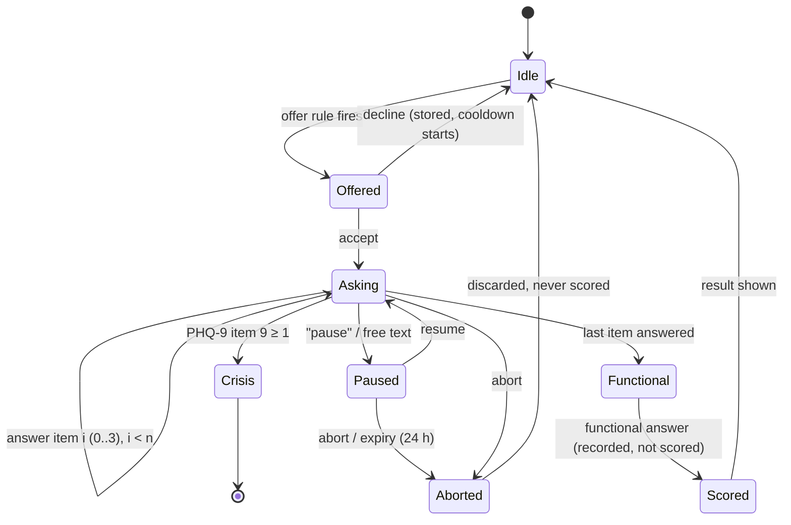

# OASIS — Detailed Design

| Field | Value |
|---|---|
| Status | Draft for approval (Step A) |
| Last updated | 2026-10-07 |
| Depends on | [PRD.md](PRD.md), [architecture.md](architecture.md), [rules.md](rules.md) |

All numeric weights, thresholds, window sizes and cooldowns below are **engineering starting values**, stored in versioned YAML, flagged `needs_clinician_review`, and listed in [clinical_review.md](clinical_review.md). The only clinically fixed numbers are the published PHQ-9 and GAD-7 scoring bands.

---

## 1. Shared types (`oasis.types`)

Frozen dataclasses (or frozen Pydantic models at the API boundary). No user text appears in any type that reaches the trace or logs.

```python
Mode = Literal[
    "crisis",
    "post_crisis",
    "assessment",
    "psychoed",
    "companion",
    "cbt",
    "dbt",
    "mindfulness",
    "grounding",
]


@dataclass(frozen=True)
class SafetyVerdict:
    is_crisis: bool
    tiers: frozenset[
        str
    ]  # {"explicit", "passive", "plan_method", "burden", "internal_error", "item9"}
    pattern_ids: tuple[str, ...]  # e.g. ("explicit.007",)
    ruleset_version: str


@dataclass(frozen=True)
class Signals:  # all floats in [0, 1] unless stated
    valence: float  # [-1, 1], VADER compound baseline
    emotions: Mapping[str, float]  # sadness, anxiety, anger, shame, loneliness
    dysregulation: float
    distortion: float
    distortion_types: frozenset[str]
    overwhelm: float
    acute_overwhelm: bool
    wants_to_talk: float  # "I just want to talk / vent"
    psychoed_cue: float
    screening_cues: Mapping[str, float]  # per PHQ/GAD domain
    explicit_screen_request: bool
    continue_request: bool  # used only in post-crisis mode
    behaviour: BehaviourFeatures
    degraded: frozenset[str]  # detectors that failed this turn


@dataclass(frozen=True)
class Plan:
    mode: Mode
    templated: bool  # True → no LLM
    template_id: str | None
    technique_id: str | None
    snippet_id: str | None
    assessment_step: AssessmentStep | None
    constraints: tuple[str, ...]  # e.g. ("one_question", "no_advice", "socratic")
    style: StyleProfile
    reason_codes: tuple[str, ...]  # e.g. ("router.margin_met", "hysteresis.3_of_3")


@dataclass(frozen=True)
class TurnTrace:  # never contains text
    turn_id: str
    stages: tuple[StageTiming, ...]  # name, start_ms, duration_ms, outcome
    safety: SafetyVerdict
    plan_mode: Mode
    llm_attempts: int
    guard_outcomes: tuple[str, ...]
    fallback_reason: str | None
    degraded: frozenset[str]
```

---

## 2. Safety layer

### 2.1 Normaliser
Applied in this order; each step is a pure function with golden tests.

1. **Unicode:** `unicodedata.normalize("NFKC", text)`; map common confusables (Cyrillic/Greek look-alikes) to ASCII via a small table; strip zero-width characters (`U+200B..U+200D`, `U+2060`, `U+FEFF`).
2. **Case:** `str.casefold()`.
3. **Leetspeak:** map `0→o, 1→i, 3→e, 4→a, 5→s, 7→t, @→a, $→s` — only inside tokens that contain at least one letter (so "I have 3 kids" is unchanged).
4. **Spacing / punctuation tricks:** collapse runs of single characters separated by spaces, dots, dashes or underscores (`k i l l`, `k.i.l.l`, `k-i-l-l` → `kill`) when the run is ≥ 3 characters.
5. **Stretched letters:** reduce any run of ≥ 3 identical letters to 2 (`kiiiill` → `kiill`). Patterns are written so that both single- and double-letter forms match (e.g. `ki{1,2}ll`), which avoids corrupting legitimate double letters.
6. **Whitespace:** collapse to single spaces; replace curly quotes/apostrophes with ASCII; keep apostrophes so "can't" stays one token, and also produce an apostrophe-free variant (`cant`) for matching.

Output: `NormalisedText(primary: str, variants: tuple[str, ...])`. Matching runs over every variant.

### 2.2 Pattern files (`content/safety/patterns.yaml`)

```yaml
version: "2026.10.0"
review_status: needs_clinician_review
tiers:
  explicit:      # stated intent to die / kill oneself
    - id: explicit.001
      pattern: '\b(kill|end)\s+(my\s*self|me)\b'
      examples: ["i want to kill myself"]
      source: "team-authored; clinician review pending"
  passive:       # wish to be dead, not wake up
  plan_method:   # references to means, timing, preparation
  burden:        # "everyone would be better off without me"
```

- Patterns are Python `re` regexes compiled once with `re.IGNORECASE`, anchored by word boundaries, and linted at load (compile, no catastrophic backtracking constructs such as nested quantifiers — checked by a simple static rule and a timing test).
- Every pattern lists at least one `examples` entry, and a test asserts each example matches.

### 2.3 Matcher

```text
function check(text) -> SafetyVerdict:
    try:
        variants = normalise(text)
        hits = []
        for tier in [explicit, plan_method, passive, burden]:
            for p in patterns[tier]:
                if any(p.regex.search(v) for v in variants):
                    hits.append(p)
        hits = [h for h in hits if not allowlisted(h, variants)]
        hits += classifier_alerts(variants)          # add-only; empty in v1
        return Verdict(is_crisis = len(hits) > 0, ...)
    except Exception:
        return Verdict(is_crisis=True, tiers={"internal_error"}, ...)   # fail closed
```

- **No negation handling.** Text like "not", "never", "wouldn't" is ignored by design.
- **Allow-list** (`allowlist.yaml`): each entry is a full idiom regex (e.g. `\bkill(ing)? it\b` in a performance sense, `\bdying to (see|know|try)\b`) **plus** the pattern IDs it may suppress. An allow-list entry only removes a hit if the idiom span *covers* the hit span, so "I'm dying to see it end, I want to kill myself" still triggers on the second clause. Each entry has a positive and a negative test.
- **Complexity:** O(patterns × variants × length); with ~200 patterns and ≤ 4 variants on ≤ 2 000-character input, well under 10 ms.

### 2.4 Crisis handoff and post-crisis state
- Reply = fixed text from `content/safety/handoff.yaml` + resources from `resources.yaml` (each entry: name, number/URL, hours, region, `verified_on`, `source_url`). A compiled-in constant copy is used if the file is unreadable.
- **Regions (decided 2026-10-07, extended same day):** **Tier 1** (verified crisis line + emergency number), 64 countries — South Asia: India, Pakistan, Bangladesh, Sri Lanka, Nepal, Bhutan, Maldives, Afghanistan; East Asia: China, Hong Kong, Taiwan, Japan, South Korea, Mongolia; Southeast Asia: Myanmar, Thailand, Vietnam, Cambodia, Laos, Malaysia, Singapore, Indonesia, Philippines, Brunei, Timor-Leste; Central Asia & Russia: Russia, Kazakhstan, Uzbekistan; Middle East & North Africa: UAE, Saudi Arabia, Qatar, Turkey, Israel, Egypt, Jordan, Iran, Morocco; Europe: United Kingdom, Ireland, Germany, France, Spain, Italy, Netherlands, Poland, Sweden, Ukraine; North America: United States, Canada, Mexico; Latin America: Brazil, Argentina, Colombia, Chile, Peru; Sub-Saharan Africa: South Africa, Nigeria, Kenya, Ghana, Uganda, Ethiopia, Tanzania; Oceania: Australia, New Zealand. **Tier 2**: every other country — emergency number only. Every card ends with "If your country isn't listed, call your local emergency number." `resources.yaml` holds, per country (ISO 3166-1 alpha-2 code), the emergency number and any verified crisis/helpline entries.
- **Country selection is user-chosen, never inferred** (consistent with the no-nationality-inference rule): an optional country picker in onboarding and settings. The crisis card and the static help card show the chosen country first, with an expandable list of all supported countries; with no choice made, the full list is shown, headed by "If you are in immediate danger, call your local emergency number."
- Where no crisis line can be verified for a country, only the emergency number is listed and the gap is recorded in `docs/reports/phase-02.md` — no unverified numbers are ever shipped.
- After a handoff, the session's `post_crisis` flag is set in memory immediately and persisted best-effort.
- **Post-crisis mode (provisional):** every message still goes through safety first. If clear, the planner emits `Plan(mode="post_crisis", templated=True)`: a short supportive template that restates resources and asks whether the user wants to continue talking. The flag clears only when `continue_request` is detected (explicit phrases such as "I want to keep talking", or the UI's "Continue" button), never by inference.
- **If storage fails** and the post-crisis flag cannot be read, the in-memory session cache is authoritative; if that too is missing (e.g. app restart), the session behaves as normal (documented limitation; flagged in clinical review).
- **Audit entry** (saved mode only, written after the reply is built): `{user_id, session_id, created_at, tiers, pattern_ids, ruleset_version, source: "text"|"item9"}`. The message text is **not** stored in the audit log.
- **Self-harm disclosure policy:** a crisis message is not passed to the turn recorder, so its text is not written to history; history shows a placeholder "Crisis support was shown." This is stated in the first-use disclosure.

---

## 3. Screening trigger

### 3.1 Readiness score
For each turn *t*, compute a per-turn evidence value:

```
e_t = Σ_d  w_d · cue_d(t)            # symptom words mapped to PHQ-9/GAD-7 domains
    + w_v · max(0, −valence_t)        # negative valence only
```

Readiness over a sliding window of the last `W = 6` user turns with linear decay:

```
R_t = Σ_{k=0}^{W-1} (1 − k/W) · e_{t−k}  /  Σ_{k=0}^{W-1} (1 − k/W)
```

### 3.2 Offer rule
Offer the instrument whose domains contributed more (PHQ-9 vs GAD-7; tie → PHQ-9) when:

- `explicit_screen_request` is true (immediate), **or**
- `R ≥ θ_offer` (start: 0.45) for `k = 3` consecutive turns,

**and all guards pass:** not crisis / post-crisis; not mid-exercise; not mid-assessment; not declined in the last `D = 10` turns or 24 h; no completed administration of the same instrument in the last **14 days** (both instruments use a two-week look-back).

The stored offer reason is a reason code plus the numeric score, e.g. `{"reason": "sustained_readiness", "R": 0.52, "turns": 3, "top_domains": ["anhedonia","sleep"]}`.

### 3.3 Evaluation
Labelled sample conversations (`should_offer` per turn) → precision, recall and offer latency (turns from first eligible point) reported in Phase 3.

---

## 4. PHQ-9 / GAD-7 state machine

### 4.1 States



### 4.2 Rules
- Item text and options come verbatim from `content/assessment/phq9.yaml` / `gad7.yaml` (verified against the published source in Phase 3; source citation and verification date stored in the file).
- Answers arrive as structured actions (`{"type": "assessment_answer", "value": 0..3}`), never parsed from free text. Free text during `Asking` moves to `Paused` and is handled as a normal turn (safety still runs first).
- **Item 9:** on value ≥ 1, the engine invokes the crisis handoff immediately (`source: "item9"`); the questionnaire is marked `escalated` and is not scored or shown as a result in that turn.
- **Scoring:** `total = Σ answers` only if all items are present; band from the table below. Incomplete → never scored.

| Instrument | Range | Bands |
|---|---|---|
| PHQ-9 | 0–27 | 0–4 minimal · 5–9 mild · 10–14 moderate · 15–19 moderately severe · 20–27 severe |
| GAD-7 | 0–21 | 0–4 minimal · 5–9 mild · 10–14 moderate · 15–21 severe |

- **Result text:** fixed plain-language text per band (`result_text.yaml`, clinician review), always with the non-diagnostic statement and a suggestion to talk to a professional where the band text says so.

---

## 5. Signals object and detectors

| Signal | Detector | Notes |
|---|---|---|
| `valence` | VADER compound score | Baseline; [-1, 1] |
| `emotions[*]` | Lexicon scorers (`content/lexicons/emotions.yaml`) | Hand-weighted; normalised by token count, clipped to [0, 1] |
| `dysregulation` | Lexicon (urge, rage, can't control, intensity markers) | DBT-leaning cue |
| `distortion`, `distortion_types` | Lexicon/regex per Burns category (all-or-nothing, overgeneralisation, mental filter, disqualifying the positive, mind reading, fortune telling, magnification, emotional reasoning, should statements, labelling, personalisation) | CBT-leaning cue; reused by the guard |
| `overwhelm`, `acute_overwhelm` | Lexicon (panic, can't breathe, too much, falling apart) + intensity markers; acute if score ≥ θ_acute | Mindfulness/grounding cue |
| `wants_to_talk` | Phrase list ("just want to talk", "just need to vent") | Companion cue |
| `psychoed_cue` | Phrase list (stigma, "what's wrong with me", "is it normal") | Psychoeducation |
| `screening_cues[*]` | Domain lexicons mapped to PHQ-9/GAD-7 domains | Screening trigger |
| `behaviour` | See §9 | Tracking |

**Lexicon scorer** (linear, explainable):

```
score(x) = clip( b + Σ_i w_i · count_i(x) / max(1, n_tokens(x)) · scale , 0, 1)
```

Features are term-count rates, so the pre-clip value is a linear model — SHAP values for it are exact (§10). Weights live in YAML with `version` and `review_status`.

---

## 6. Planner precedence

```text
function plan(signals, state, style) -> Plan:
    if state.post_crisis and not signals.continue_request:
        return Plan(mode="post_crisis", templated=True, template_id="post_crisis.check_in")
    if state.assessment.in_progress:
        return assessment.next_step(state.assessment)            # templated
    if psychoed.should_trigger(signals, state):
        return psychoed.plan(signals, style)                      # LLM phrases one vetted item
    if assessment.should_offer(signals, state):
        return assessment.offer_plan(...)                         # templated
    decision = router.route(signals, state.router)
    if decision.mode == "companion":
        return companion.plan(signals, style)
    return therapy.plan(decision, state, style)                   # cbt | dbt | mindfulness | grounding
```

- Exactly one mode per turn.
- `post_crisis` sits above the precedence list given in the architecture because it is the post-crisis policy from the methodology; it is flagged for clinician review.
- Style is attached to every plan but **read only by the prompt builder** (§12).

---

## 7. Therapy router

### 7.1 Scoring
Modes `M = {companion, cbt, dbt, mindfulness}`. Signal vector `x` (from `Signals`, plus one-hot PHQ/GAD bands when available, current-mode and exercise-state indicators).

```
score_m = b_m + Σ_s w_{m,s} · x_s
contribution_{m,s} = w_{m,s} · x_s           # exact; Σ_s contribution + b_m = score_m
```

Start weights (`content/router/weights.yaml`, clinician review): companion has the highest bias (default mode); `distortion → cbt`, `dysregulation → dbt`, `overwhelm → mindfulness`, `wants_to_talk → companion` are the dominant positive weights; moderate+ PHQ band adds to cbt; moderate+ GAD band adds to mindfulness.

### 7.2 Decision with margin and hysteresis

```text
function route(x, rs: RouterState) -> RouteDecision:
    if x.acute_overwhelm:
        return decide("grounding", reason="acute_override")         # immediate
    if rs.in_exercise and not x.opt_out:
        return decide(rs.current, reason="mid_exercise_hold")
    ranked = sort(modes by score desc)
    leader, runner = ranked[0], ranked[1]
    if leader == rs.current:
        rs.challenger, rs.streak = None, 0
        return decide(rs.current, reason="incumbent")
    if score[leader] - score[runner] < MARGIN:                       # start 0.15
        return decide(rs.current, reason="margin_not_met")
    if leader == rs.challenger: rs.streak += 1 else: rs.challenger, rs.streak = leader, 1
    if rs.streak < N:                                                 # start N = 3
        return decide(rs.current, reason=f"hysteresis.{rs.streak}_of_{N}")
    if leader != "companion" and not rs.consented(leader):
        return decide(rs.current, offer=leader, reason="offer_structured_mode")
    return decide(leader, switched=True, reason="switch")
```

- Every `RouteDecision` contains all mode scores and the ranked contributions for every mode.
- Router state (`current`, `challenger`, `streak`, `in_exercise`, consents) persists per session.

---

## 8. Hypercompliance guard

### 8.1 Inputs
`draft`, `plan`, `user_signals` (incl. `distortion_types` and the matched claim spans as token sets — not stored).

### 8.2 Checks (each returns `ok` or a reason code)
| Code | Check | Applies to |
|---|---|---|
| `G-AGREE` | Agreement marker (`you're right`, `that's true`, `exactly`, `I agree`, `it makes sense that you are`) within the same sentence as ≥ 60% token overlap with the distorted claim | Distortion turns |
| `G-LABEL` | Restates a global self-label from the user (`you are a failure/worthless/useless…`) | All |
| `G-PRESUP` | Advice that presupposes the distortion (`since nobody likes you, try…`) — advice verb + claim echo | Distortion turns |
| `G-SOCRATIC` | Distortion turn must contain a validation phrase **and** exactly one question | Distortion turns |
| `G-DX` | Diagnosis language (`you have depression`, `you are bipolar`, `sounds like you have …disorder`) | All |
| `G-MED` | Medication advice (drug names list, dose patterns, `stop/start taking`) | All |
| `C-PRAISE` | Over-praise / flattery markers above threshold | Companion |
| `C-ADVICE` | Unprompted advice imperative when plan constraint `no_advice` is set | Companion |
| `C-DEPEND` | Dependency language (`I'm always here for you`, `you don't need anyone else`, `only I understand`) | All |
| `C-ONEQ` | Exactly one question when constraint `one_question` | Companion, Socratic |
| `G-LEN` | ≤ token cap; not empty | All |

### 8.3 Flow
```text
draft = llm.generate(prompt)
v = guard.check(draft, plan, signals)
if v.ok: return draft
if remaining_budget() >= GUARD_RETRY_MIN and attempts < 2:
    draft2 = llm.generate(prompt.with_constraints(v.reasons))   # names the failed rules
    if guard.check(draft2, ...).ok: return draft2
return socratic_bank.pick(signals.distortion_types, style)       # deterministic by turn hash
```

Exactly one retry; no other LLM calls. The same `guard.check` is used for therapy and companion replies.

---

## 9. Sentiment and behaviour tracking

### 9.1 Per-turn features
| Feature | Definition | Status |
|---|---|---|
| `valence` | VADER compound | Citation checked in Phase 8 |
| `emotion_*` | Lexicon scores (§5) | Exploratory unless cited |
| `fp_pronoun_rate` | count(I, me, my, mine, myself) / tokens | Citation checked in Phase 8 |
| `absolutist_rate` | count(absolutist lexicon: always, never, completely, nothing, everything, totally…) / tokens | Citation checked in Phase 8 |
| `msg_length` | tokens in message | Exploratory |
| `reply_latency_s` | server receive time − previous bot reply time within the same session, capped at 600 s; `null` for the first message | Exploratory |
| `hour_of_day` | from `client_ts` local hour (client clock used for local time only) | Exploratory |

Latency uses **server** timestamps (client clocks are untrusted); client time is used only for local hour-of-day.

### 9.2 Aggregation
- **Per session:** mean and variance (Welford) of each feature.
- **Trend:** EWMA over session means, `α = 0.3`.
- **Change flag:** once the user has ≥ `K = 5` prior sessions, flag a session whose mean valence is more than `z = 1.5` baseline SDs from the baseline mean (baseline = all prior sessions). Label: "language-based mood trend, not a clinical measure."

---

## 10. Explanation format

### 10.1 Method
- **Lexicon scorers (linear, hand-weighted):** SHAP values computed with `shap.LinearExplainer` using a background dataset of feature rates from a synthetic neutral corpus (independent-feature assumption): `φ_i = w_i · (x_i − E[x_i])`, `base = b + Σ w_i E[x_i]`. Values are computed on the **pre-clip** linear output; when clipping changes the output, the explanation records `clipped: true`.
- **scikit-learn linear models:** `LinearExplainer` directly.
- **Router:** exact decomposition `contribution_{m,s}` (§7) — no approximation needed.
- **Black-box parts (none in v1):** LIME with a fixed seed.
- **Additivity check** at build time: `|base + Σφ − output| < 1e-6`, else the explanation is marked `inconsistent` and logged (without text).

### 10.2 Stored explanation (JSON)
```json
{
  "explanation_id": "e_7f3c…",
  "turn_id": "t_91ab…",
  "version": "1",
  "scope_note": "Explains why this response strategy was chosen. It does not explain the exact wording, which is generated by a language model.",
  "safety": {"is_crisis": false, "ruleset_version": "2026.10.0"},
  "plan": {"mode": "cbt", "reason_codes": ["router.switch", "hysteresis.3_of_3"]},
  "router": {
    "chosen": "cbt",
    "scores": {"companion": 0.41, "cbt": 0.62, "dbt": 0.18, "mindfulness": 0.30},
    "top_contributions": [
      {"signal": "distortion", "mode": "cbt", "value": 0.31},
      {"signal": "phq_band_moderate", "mode": "cbt", "value": 0.12}
    ]
  },
  "detectors": [
    {"detector": "distortion", "output": 0.64, "base": 0.05,
     "top_features": [{"feature": "overgeneralisation:always", "phi": 0.22}], "clipped": false}
  ],
  "guard": {"attempts": 1, "outcome": "pass"},
  "plain_language": [
    "Your message used words like \"always\" and \"never\", which often go with all-or-nothing thinking.",
    "So the reply gently asks a question that looks at the thought from another angle (a CBT approach)."
  ],
  "status": "ok"
}
```
Feature names are lexicon keys, never raw user text. `status ∈ {ok, unavailable, inconsistent}`.

---

## 11. Data model (SQLite, STRICT)

All IDs are `TEXT` (32-char hex UUIDv4). All timestamps are `TEXT` ISO-8601 UTC (`2026-10-07T12:00:00.000Z`). Every table except `schema_migrations` carries `user_id` with `ON DELETE CASCADE`.

```sql
CREATE TABLE users (
  user_id     TEXT PRIMARY KEY,
  created_at  TEXT NOT NULL
) STRICT;

CREATE TABLE sessions (
  session_id_hash TEXT PRIMARY KEY,            -- SHA-256 of the bearer session ID
  user_id     TEXT NOT NULL REFERENCES users(user_id) ON DELETE CASCADE,
  created_at  TEXT NOT NULL,
  last_seen_at TEXT NOT NULL,
  post_crisis INTEGER NOT NULL DEFAULT 0 CHECK (post_crisis IN (0,1)),
  router_state TEXT NOT NULL DEFAULT '{}'      -- JSON
) STRICT;

CREATE TABLE turns (
  turn_id     TEXT PRIMARY KEY,
  user_id     TEXT NOT NULL REFERENCES users(user_id) ON DELETE CASCADE,
  session_id_hash TEXT NOT NULL REFERENCES sessions(session_id_hash) ON DELETE CASCADE,
  seq         INTEGER NOT NULL,
  role        TEXT NOT NULL CHECK (role IN ('user','assistant','placeholder')),
  content     TEXT NOT NULL,
  mode        TEXT,
  created_at  TEXT NOT NULL,
  trace       TEXT,                            -- JSON TurnTrace, no text
  UNIQUE (session_id_hash, seq)
) STRICT;

CREATE TABLE signals (
  turn_id     TEXT PRIMARY KEY REFERENCES turns(turn_id) ON DELETE CASCADE,
  user_id     TEXT NOT NULL REFERENCES users(user_id) ON DELETE CASCADE,
  features    TEXT NOT NULL,                   -- JSON per §9.1
  created_at  TEXT NOT NULL
) STRICT;

CREATE TABLE assessments (
  assessment_id TEXT PRIMARY KEY,
  user_id     TEXT NOT NULL REFERENCES users(user_id) ON DELETE CASCADE,
  instrument  TEXT NOT NULL CHECK (instrument IN ('PHQ9','GAD7')),
  status      TEXT NOT NULL CHECK (status IN ('offered','declined','in_progress','paused','aborted','escalated','scored')),
  offer_reason TEXT NOT NULL,                  -- JSON reason code + score
  total       INTEGER CHECK (total IS NULL OR total BETWEEN 0 AND 27),
  band        TEXT,
  functional  INTEGER CHECK (functional IS NULL OR functional BETWEEN 0 AND 3),
  created_at  TEXT NOT NULL,
  completed_at TEXT,
  CHECK (status <> 'scored' OR (total IS NOT NULL AND band IS NOT NULL)),
  CHECK (instrument <> 'GAD7' OR total IS NULL OR total <= 21)
) STRICT;

CREATE TABLE assessment_answers (
  assessment_id TEXT NOT NULL REFERENCES assessments(assessment_id) ON DELETE CASCADE,
  user_id     TEXT NOT NULL REFERENCES users(user_id) ON DELETE CASCADE,
  item_index  INTEGER NOT NULL CHECK (item_index BETWEEN 1 AND 9),
  value       INTEGER NOT NULL CHECK (value BETWEEN 0 AND 3),
  answered_at TEXT NOT NULL,
  PRIMARY KEY (assessment_id, item_index)
) STRICT;

CREATE TABLE explanations (
  explanation_id TEXT PRIMARY KEY,
  turn_id     TEXT NOT NULL REFERENCES turns(turn_id) ON DELETE CASCADE,
  user_id     TEXT NOT NULL REFERENCES users(user_id) ON DELETE CASCADE,
  body        TEXT NOT NULL,                   -- JSON per §10.2
  status      TEXT NOT NULL CHECK (status IN ('ok','unavailable','inconsistent')),
  created_at  TEXT NOT NULL
) STRICT;

CREATE TABLE audit_log (
  audit_id    TEXT PRIMARY KEY,
  user_id     TEXT NOT NULL REFERENCES users(user_id) ON DELETE CASCADE,
  event       TEXT NOT NULL CHECK (event IN ('crisis_handoff','consent_given','consent_withdrawn','export','settings_changed')),
  detail      TEXT NOT NULL,                   -- JSON, never message text
  created_at  TEXT NOT NULL
) STRICT;

CREATE TABLE consent (
  user_id     TEXT PRIMARY KEY REFERENCES users(user_id) ON DELETE CASCADE,
  disclosure_version TEXT NOT NULL,
  given_at    TEXT NOT NULL
) STRICT;

CREATE TABLE settings (
  user_id     TEXT PRIMARY KEY REFERENCES users(user_id) ON DELETE CASCADE,
  directness  TEXT NOT NULL DEFAULT 'balanced' CHECK (directness IN ('direct','balanced','indirect')),
  formality   TEXT NOT NULL DEFAULT 'neutral'  CHECK (formality IN ('casual','neutral','formal')),
  country     TEXT,                            -- optional, user-chosen ISO code for crisis resources; validated against resources.yaml
  updated_at  TEXT NOT NULL
) STRICT;

CREATE TABLE schema_migrations (
  version     INTEGER PRIMARY KEY,
  applied_at  TEXT NOT NULL
) STRICT;
```

Tables are introduced by the phase that needs them (`0001_init.sql` in Phase 1 creates `users`, `sessions`, `turns`, `schema_migrations`; later migrations add the rest).

**Connection setup (every connection):** `journal_mode=WAL`, `foreign_keys=ON`, `busy_timeout=2000`, `synchronous=NORMAL`, `secure_delete=ON`.

**Retention:** saved-mode data is kept until the user deletes it. No automatic expiry in v1 (documented). Crisis audit entries are deleted with the account.

### 11.1 Ephemeral in-memory twin
`MemoryRepository` implements the same `Repository` protocol with dicts keyed by `user_id`, guarded by an `asyncio.Lock`. Ephemeral sessions expire after 2 h idle or on process restart. Nothing is written to disk: no SQLite, no temp files, no content in logs. Ephemeral mode is chosen at onboarding and cannot be switched to saved mode mid-session without starting a new session (prevents partial persistence).

### 11.2 Repository protocol (excerpt)
```python
class Repository(Protocol):
    async def create_user(self) -> str: ...
    async def create_session(self, user_id: str, session_id_hash: str) -> None: ...
    async def append_turn(self, user_id: str, turn: TurnRecord) -> None: ...
    async def recent_turns(
        self, user_id: str, session_id_hash: str, limit: int
    ) -> list[TurnRecord]: ...
    async def load_state(self, user_id: str, session_id_hash: str) -> ConversationState: ...
    async def save_explanation(self, user_id: str, e: ExplanationRecord) -> None: ...
    async def get_explanation(
        self, user_id: str, explanation_id: str
    ) -> ExplanationRecord | None: ...
    async def export_user(self, user_id: str) -> UserExport: ...
    async def delete_user(self, user_id: str) -> None: ...
```
SQLite calls run in a thread (`asyncio.to_thread`) with one writer connection serialised by a lock.

---

## 12. API contracts

All endpoints: JSON; `X-OASIS-Session: <token>` header (except `POST /session` and `GET /health`); security headers; `Cache-Control: no-store`. Request bodies ≤ 16 KB.

**Error shape (all non-2xx):**
```json
{"error": {"code": "consent_required", "message": "Please review and accept the data notice first."}}
```

| Method & path | Request | Response 2xx | Errors |
|---|---|---|---|
| `GET /health` | — | `{"status":"ok","llm":"up\|down\|unknown","storage":"up\|down","version":"…"}` | — |
| `POST /session` | `{"ephemeral": bool}` | `201 {"session_id": "<256-bit token>", "ephemeral": bool, "consent_required": bool}` | 422 |
| `POST /consent` | `{"disclosure_version": "1"}` | `204` | 401, 422 |
| `POST /chat` | `{"message": str (1–2000 chars) \| null, "client_ts": ISO-8601, "action": Action \| null}` | `200 ChatResponse` | 401 `invalid_session`, 403 `consent_required` (non-crisis only, §3.3 of architecture), 422 `invalid_turn` |
| `GET /history?limit=50&before=<turn_id>` | — | `200 {"turns": [{"turn_id","role","content","mode","created_at"}], "next": str\|null}` | 401 |
| `GET /explanations/{explanation_id}` | — | `200 Explanation (§10.2)` | 401, 404 |
| `GET /trends` | — | `200 {"label": "language-based mood trend, not a clinical measure", "sessions": [...], "ewma": [...], "change_flags": [...]}` | 401 |
| `GET /settings` / `PUT /settings` | `{"directness","formality"}` | `200 Settings` | 401, 422 |
| `GET /export` | — | `200 UserExport` (all tables for the user, JSON, `Content-Disposition: attachment`) | 401 |
| `DELETE /account` | `{"confirm": "DELETE"}` | `204` | 401, 422 |
| `GET /debug/turns/{turn_id}` | — | `200 {"trace": TurnTrace, "plan": Plan, "explanation": …}` — own user only; disabled unless `OASIS_DEBUG_VIEW=1` | 401, 404 |

**Action** (structured, from buttons):
```json
{"type": "assessment_consent", "accept": true}
{"type": "assessment_answer", "value": 2}
{"type": "assessment_pause"} | {"type": "assessment_abort"}
{"type": "mode_consent", "mode": "cbt", "accept": true}
{"type": "exercise_opt_out"}
{"type": "continue_after_crisis"}
```

**ChatResponse:**
```json
{
  "turn_id": "t_…",
  "reply": "…",
  "mode": "companion",
  "templated": false,
  "explanation_id": "e_…",
  "assessment": null,
  "crisis": null,
  "persisted": true,
  "degraded": []
}
```
- `assessment` (when in an assessment): `{"instrument","item_index","item_count","item_text","options":[{"value":0,"label":"…"}…],"result":{"total","band","text"}|null}`.
- `crisis` (on handoff): `{"resources":[{"name","contact","hours"}], "message": "…"}`; `explanation_id` is `null` on crisis turns.
- On crisis turns the HTTP status is always `200`, even for unconsented or unknown sessions.

---

## 13. Prompt design

### 13.1 System prompt template (abridged; full text in `content/prompts/system.yaml`)
```
You are OASIS, a supportive listening companion. You are not a therapist or a doctor.
Never diagnose. Never give medication advice. Never claim to be human.
Write {max_sentences} sentences or fewer, plain words, no lists, no emojis.
Follow the PLAN exactly. Do not change its approach.
{style_framing}
PLAN:
- mode: {mode}
- goal: {goal_text}
- must: {constraints_as_text}
{snippet_block}
```
History is passed as alternating chat messages (last `H` turns), followed by the user's message.

### 13.2 Plan → prompt mapping
| Mode | Goal text (example) | Constraints | Snippet |
|---|---|---|---|
| companion | "Reflect the feeling you notice, then ask one gentle open question." | one_question, no_advice, no_praise | none |
| cbt | "Acknowledge the feeling. Invite them to examine the thought with one Socratic question." | validate_first, one_question, socratic | one CBT technique snippet |
| dbt | "Acknowledge the intensity. Offer the named skill briefly and ask if they'd like to try it." | validate_first, offer_not_instruct | one DBT skill snippet |
| mindfulness / grounding | "Guide one short, low-risk grounding step from the script." | follow_script, one_step | one script step |
| psychoed | "Explain the concept in the snippet in two or three plain sentences, without diagnosing." | no_diagnosis, use_snippet_only | one psychoeducation item |
| assessment / crisis / post_crisis | — templated, no prompt — | | |

### 13.3 Token budget (context 4096; target prompt ≤ ~1 500 tokens for CPU first-token time)
| Part | Budget |
|---|---|
| System + plan + style | ≤ 450 |
| Snippet | ≤ 200 |
| History (most recent first, truncated at turn boundary) | ≤ 600 |
| User message (truncated with notice if longer) | ≤ 300 |
| Reply (`max_tokens`) | 160 |

Token counts use the server's `/tokenize` endpoint when available, else a conservative chars/3.5 estimate.

### 13.4 Sampling (starting values; re-verify against the current model card)
Non-thinking mode for Qwen3.5: `temperature 0.7, top_p 0.8, top_k 20, min_p 0.0`; thinking disabled via the chat-template argument (`chat_template_kwargs: {"enable_thinking": false}`) and `llama-server --jinja`. Output post-processing strips `<think>…</think>` and any unterminated `<think>` tail; output that is empty after stripping counts as an LLM failure. The bake-off records the final settings.

---

## 14. Content library format

Every file has a header and every item has provenance:

```yaml
schema: oasis.content/v1
kind: socratic_question_bank        # one of the kinds below
version: "2026.10.0"
review_status: needs_clinician_review   # draft | needs_clinician_review | clinician_reviewed
items:
  - id: soc.overgeneralisation.001
    text: "What's one time, even a small one, when that didn't turn out the way you expected?"
    applies_to: [overgeneralisation, all_or_nothing]
    source: "Adapted from standard CBT Socratic questioning; team-authored"
    version: "1"
    review_status: needs_clinician_review
```

| Kind | Item fields (beyond `id, source, version, review_status`) |
|---|---|
| `crisis_patterns` | `tier`, `pattern`, `examples[]` |
| `allowlist` | `pattern`, `suppresses[]`, `positive_example`, `negative_example` |
| `crisis_resources` | `name`, `contact`, `hours`, `region`, `verified_on`, `source_url` |
| `lexicon` | `term` or `pattern`, `weight`, `category` |
| `assessment_instrument` | `instrument`, `item_index`, `text`, `options[]{value,label}`, plus file-level `citation`, `verified_on` |
| `technique_script` | `mode`, `title`, `steps[]`, `risk_level: low`, `contraindications[]` |
| `psychoed_item` | `topic`, `text`, `reading_level`, `cues[]` |
| `socratic_question_bank` | `text`, `applies_to[]` |
| `template` | `template_id`, `text`, `variants[]` |

All files are validated against Pydantic schemas at startup; invalid content refuses startup.

---

## 15. UI/UX design

### 15.1 Screens
1. **Onboarding** — what OASIS is and is not (subclinical, not diagnostic, not for emergencies); data-use disclosure; choice of saved vs ephemeral; consent button. "Need help now?" visible here too.
2. **Chat** — message list, input, send; persistent footer "Support tool, not a diagnosis or emergency service"; "Need help now?" button top-right; development banner while applicable.
3. **Assessment card** — inline card: instrument name, "Question 3 of 9", item text, four large 0–3 buttons with labels, Pause and Stop links.
4. **Score explanation** — total, band in words, plain-language meaning, non-diagnostic statement, "talk to a professional" text when the band text says so.
5. **"Why this reply" panel** — expandable under each bot message; plain-language bullets; scope note (§10.2); "See details" for the debug view.
6. **Mood-trend view** — simple line of session means with the non-clinical label always visible.
7. **Settings** — style profile (two segmented controls with examples), ephemeral status, Export, Delete (two-step confirm).
8. **Crisis card** — replaces the input area focus: calm heading, resources as large tappable links (`tel:`), "Continue talking" button.
9. **Debug view** — trace, plan, scores, contributions (own data only).

### 15.2 Visual style
| Token | Light | Dark |
|---|---|---|
| `--bg` | `#F7F6F2` | `#1B1C1E` |
| `--surface` | `#FFFFFF` | `#25272A` |
| `--text` | `#1F2328` | `#E8E6E1` |
| `--muted` | `#5B616B` | `#A6ABB3` |
| `--accent` (safety/info) | `#2F6FD1` | `#7EA8EC` |
| `--warm` (bot bubble) | `#FDECE6` | `#3A2A24` |
| `--focus` | `#1A56C4` outline 3 px | `#9CC0FF` |

- Typography: system font stack (`system-ui, -apple-system, "Segoe UI", Roboto, sans-serif`), 17 px base, line-height 1.55, max line length ~65 ch.
- Spacing scale: 4, 8, 12, 16, 24, 32 px. Rounded 12 px corners. No animation beyond 150 ms fades; none when `prefers-reduced-motion`.
- All text/background pairs meet WCAG 2.2 AA (checked by a script in Phase 13).

### 15.3 Tone of voice
Warm, plain, brief, non-judgemental; second person; no exclamation marks, no emojis, no clinical jargon, no false promises ("everything will be fine"), no claims of being human or of feelings. Templates follow the same rules.

### 15.4 States
- **Empty:** a short greeting and one example of what the user can say.
- **Loading:** "OASIS is thinking…" with `aria-busy`; input stays editable; after 8 s, "Still working — this can take a few seconds on this computer."
- **Error / offline:** "I couldn't reach the server. Your message wasn't sent." + Retry; the help button still works.
- **Busy:** templated reply "I'm handling a lot right now — could you give me a moment and send that again?"

### 15.5 Keyboard and screen readers
Enter sends, Shift+Enter newline; Tab order: help button → messages → input → send; assessment buttons are a `radiogroup` with arrow-key navigation; new messages announced via `aria-live="polite"`, crisis card via `role="alert"`; focus moves to the crisis card heading on handoff.

---

## 16. Error handling matrix

| Failure | Detection | Behaviour | User-facing message | Trace code |
|---|---|---|---|---|
| Safety internal error | exception in gate | Treat as crisis (fail closed) | Crisis card | `safety.internal_error` |
| LLM down | connect error < 1 s | Templated reply for plan mode | Normal-sounding templated reply | `llm.down` |
| LLM slow | read timeout / deadline | Templated reply | Templated reply | `llm.timeout` |
| LLM empty / think-only | empty after stripping | Templated reply | Templated reply | `llm.empty` |
| LLM queue full | limiter | Immediate busy template | "I'm handling a lot right now…" | `llm.busy` |
| Guard rejects twice | guard verdicts | Socratic fallback | Vetted Socratic question | `guard.fallback` |
| Guard retry skipped | budget < min | Socratic fallback | Vetted Socratic question | `guard.no_budget` |
| DB locked | busy timeout | Continue stateless; recorder retries once | Reply + small "may not be saved" note | `storage.busy` |
| DB unavailable | `StorageUnavailable` | Continue stateless; skip recording | Reply + "may not be saved" note | `storage.down` |
| Explainability error | exception in builder | Store/return `unavailable` | Panel: "Explanation unavailable for this reply." | `explain.error` |
| Planner/detector error | exception | Companion templated plan; detector neutral | Templated reply | `planner.error` / `detector.<name>` |
| Request deadline exceeded | engine deadline | Templated reply | Templated reply | `request.deadline` |
| Invalid content at startup | schema validation | Refuse to start | — (operator log) | — |
| Frontend cannot reach server | fetch error | Offline state; help card still works | "I couldn't reach the server…" | — |
